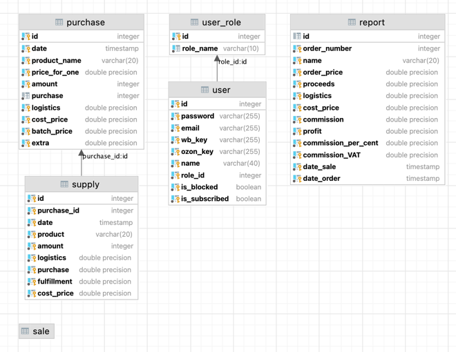

# Marketplace Automation

Full-stack web application for automating seller operations on a marketplace platform. Built as a traineeship diploma project during the **SaM Solutions Spring Internship (Dec 2021 – Jan 2022)**.

## Tech Stack

**Backend**
- Java 8+, Spring Boot, Spring MVC, Spring Security
- Hibernate ORM, PostgreSQL
- JWT authentication
- Apache Tomcat 9 deployment (WAR packaging)

**Frontend**
- Angular 13, TypeScript
- HTML5, CSS3 (custom design via Figma)

## Features

- **Authentication & Authorization** — JWT-based login and registration with role-based access control
- **User Management** — full CRUD for user accounts and roles
- **Purchase & Sales Tracking** — manage purchase orders and sales records
- **Supply & Storage** — track inventory across storage locations
- **Reporting** — generate and view operational reports
- **Subscriptions** — subscription management per seller
- **Geographic Data** — country and town entity support

## Project Structure

```
marketplace-automation/
├── backend/      # Spring Boot application
├── frontend/     # Angular application
├── database.sql  # PostgreSQL schema
└── database.png  # Entity-relationship diagram
```

## Getting Started

### Prerequisites
- Java 8+
- Node.js + Angular CLI
- PostgreSQL
- Apache Tomcat 9.0.55

### Backend

1. Create a PostgreSQL database and run `database.sql`
2. Update `backend/src/main/resources/application.properties`:
   ```properties
   db.url=your_database_name
   db.username=your_username
   db.password=your_password
   ```
3. Build the WAR file via Maven: `clean → install`
4. Deploy the generated `.war` to Tomcat (Run/Debug Configuration → Deployment → Artifact:war)

### Frontend

```bash
cd frontend
npm install
npm start
```
App available at `http://localhost:4200`

## Database Schema


